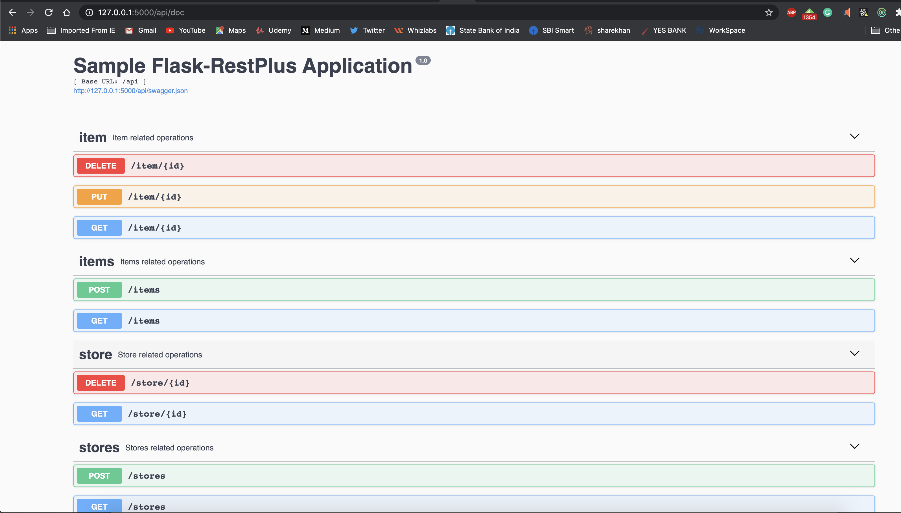

## Sample Flask application using [Flask-RESTPlus](https://flask-restplus.readthedocs.io/en/stable/index.html) , [Flask-Marshmallow](https://flask-marshmallow.readthedocs.io/en/latest/) and [Flask-SQLAlchemy](https://flask-sqlalchemy.palletsprojects.com/en/2.x/quickstart/)

## Setting up the VirtualEnv and install dependencies
Go inside the project folder and execute the below commands. We will use [Pipenv](https://pypi.org/project/pipenv/) to setup the VirtualEnv.

```
pipenv shell
pipenv install

```
Dependencies will be installed from the Pipfile. Python version 3.7 is used for this project.

## Run the Application

```
python app.py

```

This will start the application on port 5000

## Test the application

Swagger-UI can be used to test the application.


The server will start at <http://localhost:5000>.

https://github.com/jarus/flask-testing/issues/143
